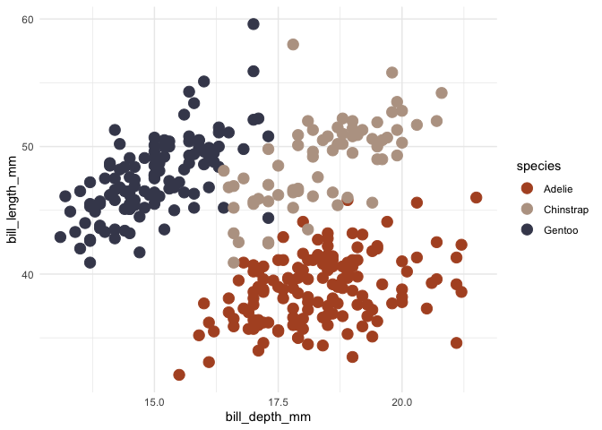
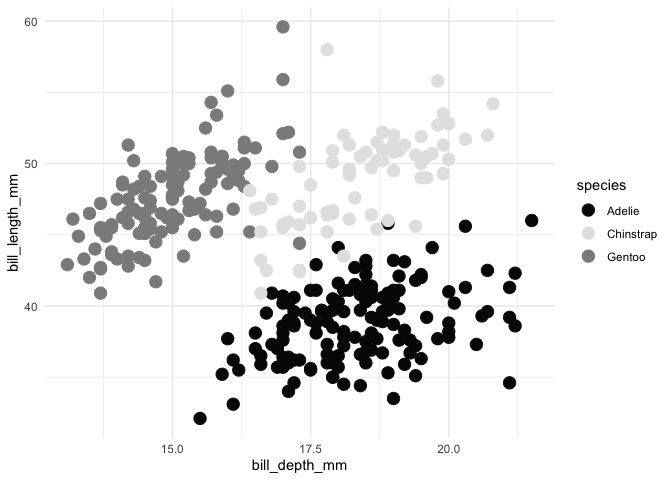
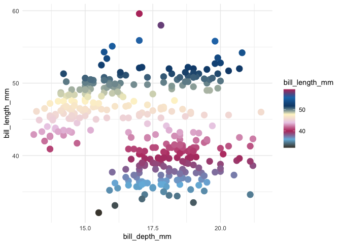
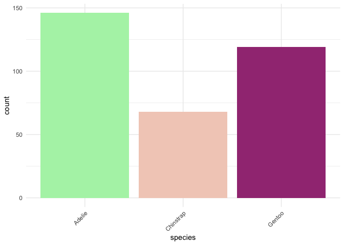

<!-- README.md is generated from README.Rmd. Please edit that file -->

# tayloRswift

<!-- badges: start -->
<!-- badges: end -->

A ggplot2 color palette based on Taylor Swift Album Covers.

## Installation

You can install the released version of tayloRswift with:

``` r
remotes::install_github("tayloRswift")
```

## Swift up your graphs with Taylor Swift palettes.

### Color by discrete variable using default palette

``` r
ggplot(penguins, aes(bill_depth_mm, bill_length_mm, color = species)) +
  geom_point(size = 4) +
  scale_color_taylor()+
  theme_minimal()
```



### Choose a different palette

``` r
ggplot(penguins, aes(bill_depth_mm, bill_length_mm, color = species)) +
  geom_point(size = 4) +
  scale_color_taylor(palette = "reputation")+
  theme_minimal()
```



### Color by numeric variable

``` r
ggplot(penguins , aes(bill_depth_mm, bill_length_mm,color = bill_length_mm)) +
  geom_point(size = 4, alpha = .6) +
  scale_color_taylor(discrete = FALSE)+
  theme_minimal()
```



### Fill by discrete variable

``` r
ggplot(mpg, aes(manufacturer, fill = manufacturer)) +
  geom_bar() +
  theme_minimal()+
  theme(axis.text.x = element_text(angle = 45, hjust = 1)) +
  scale_fill_taylor(palette = "speakNow", guide = "none")
```


