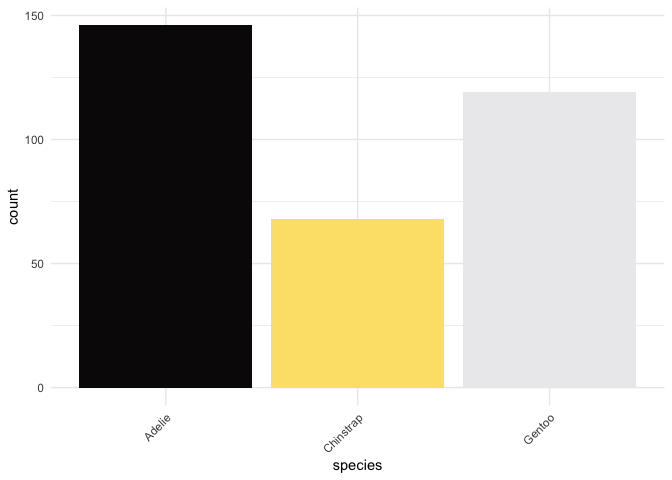

<!-- README.md is generated from README.Rmd. Please edit that file -->

# tayloRswift

<!-- badges: start -->

[](https://github.com/asteves/tayloRswift/actions)
[](https://app.codecov.io/gh/asteves/tayloRswift?branch=main)

<!-- badges: end -->

A ggplot2 color palette based on Taylor Swift Album Covers.


The package includes palettes for every full album except for those that
Taylor Swift has disavowed.

## Installation

You can install the CRAN version of tayloRswift with:

``` r
install.packages(c("tayloRswift"))
```

Alternatively, you can install the development version with:

``` r
remotes::install_github("asteves/tayloRswift")
```

and load it with

``` r
library(tayloRswift)
```

## Examples

Color by discrete variable using default palette based on
[1989](https://en.wikipedia.org/wiki/1989_(Taylor_Swift_album))

``` r
ggplot(penguins, aes(bill_depth_mm, bill_length_mm, color = species)) +
  geom_point(size = 4) +
  scale_color_taylor()+
  theme_minimal()
```


### Choose a different palette

[Reputation](https://en.wikipedia.org/wiki/Reputation_(Taylor_Swift_album))
works great as a grayscale.

``` r
ggplot(penguins, aes(bill_depth_mm, bill_length_mm, color = species)) +
  geom_point(size = 4) +
  scale_color_taylor(palette = "reputation")+
  theme_minimal()
```


### Color by numeric variable

Be content with a palette based on
[Fearless](https://en.wikipedia.org/wiki/Fearless_(Taylor%27s_Version))

``` r
ggplot(penguins , aes(bill_depth_mm, bill_length_mm,color = bill_length_mm)) +
  geom_point(size = 4) +
  scale_color_taylor(discrete = FALSE, palette ="fearless")+
  theme_minimal()
```


### Fill by discrete variable

Pop with color from [Lover](https://en.wikipedia.org/wiki/Lover_(album))

``` r
ggplot(mpg, aes(manufacturer, fill = manufacturer)) +
  geom_bar() +
  theme_minimal()+
  theme(axis.text.x = element_text(angle = 45, hjust = 1)) +
  scale_fill_taylor(palette = "lover", guide = "none")
```


Or if you prefer modern Swift,
[Folklore](https://en.wikipedia.org/wiki/Folklore_(Taylor_Swift_album))

``` r
ggplot(penguins, aes(species, fill = species)) +
  geom_bar() +
  theme_minimal()+
  theme(axis.text.x = element_text(angle = 45, hjust = 1)) +
  scale_fill_taylor(palette = "folklore", guide = "none")
```



## Palettes


`taylorSwift`= “\#61b6cc”, “\#577f3f”, “\#e3e9f3”, “\#0a1605”, “\#fddac7”, “\#81a757”


`fearless` = "\#DCBE83", "\#88642C", "\#EDE7D9", "\#EFD998", "\#49260A", "\#EFB391"

_(2021_album_cover)_by_Taylor_Swift.png)

`fearlessTV` = “\#b68f51”, “\#5b3617”, “\#f7eabe”, “\#ecd59f”, “\#825c2d”


`speakNow` = “\#ffffff”, “\#4b2671”, “\#5e291c”, “\#f3d8c4”, “\#f3bf73”


`speakNowLive` = “\#fce178”, “\#969696”, “\#871d20”, “\#090708”, “\#fafaf9”


`speakNowTV` = "#351E2E","#481E52","#AE6D4F","#884885","#C44D56","#A0659F"


`Red` = #B11E4A", "#A14053", "#8E7F6C", "#1B1C38", "EBEDDF", "9D8B6D") 

.png)
`taylorRed` = “\#b1532a”,“\#84697f”,“\#cbb593”,“\#a88f92”,“\#e8eadf”,“\#43475b”


`taylor1989` = “\#b1532a”, “\#84697f”, “\#cbb593”, “\#a88f92”, “\#e8eadf”, “\#43475b”


`TS1989` = "\#D9523F", "\#D1CFC2", "\#ACBCCC","\#588383","\#AA6F4E","\#8898A1"

In addition, the package comes with palettes for alternate album covers
as well.

`SunriseBoulevard1989` = "\#2B3849","\#6C1414","\#C8AA86","\#D0C9B9","\#888D50","\#313C40"

`AquamarineGreen1989` = "\#101C18", "\#C19298", "\#5B96A5","\#90A5A8","\#9A241F","#938C7C"

`RoseGardenPink1989` = "\#8A9DAC", "\#9E948A","\#DD8253","\#B4AEAF","\#B6723C","\#7F8491"


`reputation` = “\#060606”, “\#6e6e6e”, “\#fefefe”, “\#cacaca”, “\#060606”, “\#8c8c8c”


`lover` = “\#b8396b”, “\#ffd1d7”, “\#fff5cc”, “\#76bae0”, “\#b28f81”, “\#54483e”


`folklore`= “\#272727”, “\#5c5c5c”, “\#bababa”, “\#f8f8f8”


`evermore` = “\#3d2620”, “\#efefef”, “\#827d73”, “\#efefef”, “\#3d2620”


`midnights` = “\#586891”,“\#8897A4”,“\#B3A6A3”,“\#2B152C”,“\#F1F3F2”

In addition, the package comes with palettes for alternate album covers
as well.

`midnightsBloodMoon` = “\#651D32”, “\#80433F”, “\#BC7B55”, “\#AD9291”, “\#E9E8E4”

`midnightsJadeGreen` = “\#E8E7E3”, “\#CE986B”, “\#2F3C30”, “\#0B0B08”, “\#B98645”, “\#8D8C7A”

`midnightsMahogany` = “\#AE9975”, “\#2B181F”, “\#E2E1DD”, “\#948266”, “\#AD8E49”


`TSTTPD` = "\#8D8171", "\#C6C0B8", "\#49433B", "\#FDFDFD", "\#322B25","\#ADA69C"

## Related Packages

For those who work in Python, it was brought to my attention that there
is a very cool package by [Josh Borrow](https://github.com/JBorrow)
called [swiftacsmaps](https://github.com/JBorrow/swiftascmaps).

Other inspirations for this package are the tutorial on [creating
corporate color
palettes](https://drsimonj.svbtle.com/creating-corporate-colour-palettes-for-ggplot2)
by [Dr. Simon Jackson](https://github.com/drsimonj), which I drew on
heavily. I have long used the
[wesanderson](https://github.com/karthik/wesanderson) package by
[Karthik Ram](https://github.com/karthik), which does a similar task.
