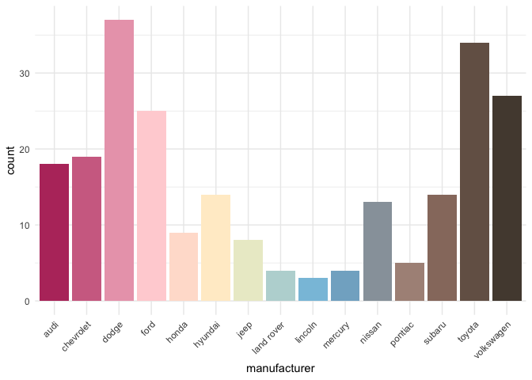

<!-- README.md is generated from README.Rmd. Please edit that file -->

# tayloRswift

<!-- badges: start -->
<!-- badges: end -->

A ggplot2 color palette based on Taylor Swift Album Covers. Palettes for
every album except for those that Taylor Swift has disavowed.

## Installation

You can install the released version of tayloRswift with:

``` r
remotes::install_github("tayloRswift")
```

## Examples

Color by discrete variable using default palette based on
[1989](https://en.wikipedia.org/wiki/1989_(Taylor_Swift_album))

``` r
ggplot(penguins, aes(bill_depth_mm, bill_length_mm, color = species)) +
  geom_point(size = 4) +
  scale_color_taylor()+
  theme_minimal()
```


### Choose a different palette

[Reputation](https://en.wikipedia.org/wiki/Reputation_(Taylor_Swift_album))
works great as a grayscale.

``` r
ggplot(penguins, aes(bill_depth_mm, bill_length_mm, color = species)) +
  geom_point(size = 4) +
  scale_color_taylor(palette = "reputation")+
  theme_minimal()
```


### Color by numeric variable

Be content with a palette based on
[Lover](https://en.wikipedia.org/wiki/Lover_(album))

``` r
ggplot(penguins , aes(bill_depth_mm, bill_length_mm,color = bill_length_mm)) +
  geom_point(size = 4) +
  scale_color_taylor(discrete = FALSE, palette ="lover")+
  theme_minimal()
```


### Fill by discrete variable

Pop with color from [Speak Now](https://en.wikipedia.org/wiki/Speak_Now)

``` r
ggplot(penguins, aes(species, fill = species)) +
  geom_bar() +
  theme_minimal()+
  theme(axis.text.x = element_text(angle = 45, hjust = 1)) +
  scale_fill_taylor(palette = "speakNow", guide = "none")
```



Or if you prefer the live recording of the [World
Tour](https://en.wikipedia.org/wiki/Speak_Now_World_Tour_%E2%80%93_Live)

``` r
ggplot(penguins, aes(species, fill = species)) +
  geom_bar() +
  theme_minimal()+
  theme(axis.text.x = element_text(angle = 45, hjust = 1)) +
  scale_fill_taylor(palette = "speakNowLive", guide = "none")
```


